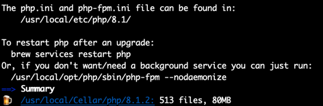
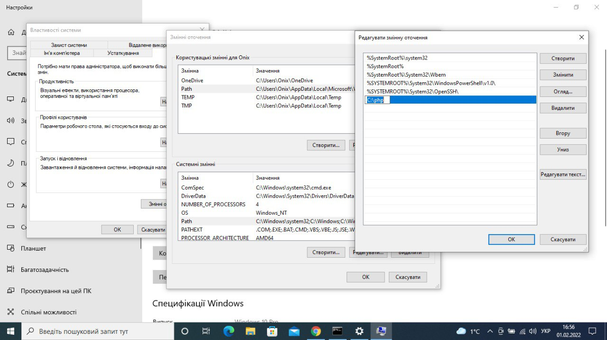

## Установка php 

- Install PHP for Ubuntu
```shell
#Make sure your Ubuntu server is having the latest packages by running the following command
sudo apt update
sudo apt upgrade

#Add the ondrej/php which has PHP 8 package and other required PHP extensions.
sudo apt install software-properties-common
sudo add-apt-repository ppa:ondrej/php
sudo apt update

#install php
sudo apt install php8.1-fpm
#check installation of php
php -v

#go to path with project and run php server
php -S 127.0.0.1:8080
```
- Install PHP for macOS
```shell
#check installing XCode
xcode-select -p

# if don't have - install Command Line Tools
xcode-select --install

# install brew if you don't have
/bin/bash -c "$(curl -fsSL https://raw.githubusercontent.com/Homebrew/install/HEAD/install.sh)"

brew update

#install php
brew install php

#check installation of php
php -v

#go to path with project and run php server
php -S 127.0.0.1:8080
```

- Install PHP for Windows
  - Качаем архив Thread Safe с нужной разрядностью по [ссылке](https://windows.php.net/download#php-8.1) на диск C
  - Разархивируем скачанный архив в C:\php
  - Переименовываем php.ini-development в php.ini 
  - Прописываем путь к php в переменные окружения 
    - В строке "Поиск" выполните поиск: Система (Панель управления)
    - Нажмите на ссылку Дополнительные параметры системы. 
    - Нажмите Переменные среды. В разделе Переменные среды выберите переменную среды PATH. Нажмите Изменить. Если переменной PATH не существует, нажмите Создать. 
    - В окне Изменение системной переменной (или Новая системная переменная) укажите значение переменной среды PATH. Нажмите ОК. Закройте остальные открытые окна, нажимая ОК.
    
  - Качаем Visual С++ с нужной разрядностью по [ссылке](https://docs.microsoft.com/ru-ru/cpp/windows/latest-supported-vc-redist?view=msvc-170) и устанавливаем
  - Открываем терминал
```shell
#check installation of php
php -v

#go to path with project and run php server
php -S 127.0.0.1:8080
```