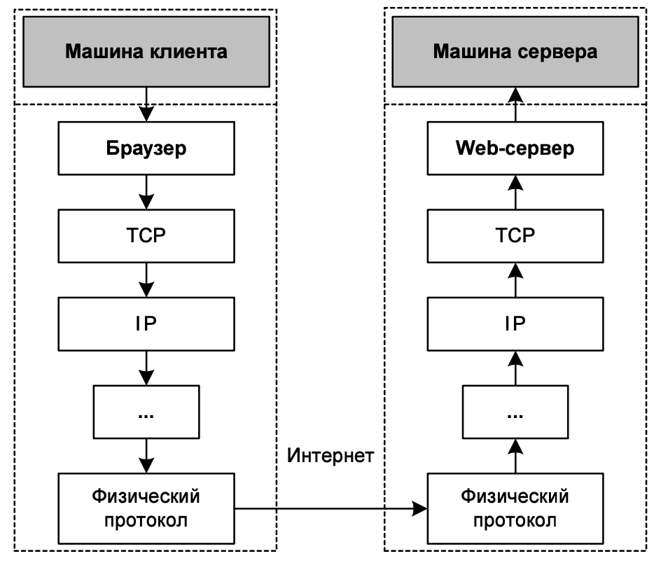

# Установка php

- Install PHP for Ubuntu
```shell
#Make sure your Ubuntu server is having the latest packages by running the following command
sudo apt update
sudo apt upgrade

#Add the ondrej/php which has PHP 8 package and other required PHP extensions.
sudo apt install software-properties-common
sudo add-apt-repository ppa:ondrej/php
sudo apt update

#install php
sudo apt install php8.1-fpm
#check installation of php
php -v

#go to path with project and run php server
php -S 127.0.0.1:8080
```
- Install PHP for macOS
```shell
#check installing XCode
xcode-select -p

# if don't have - install Command Line Tools
xcode-select --install

# install brew if you don't have
/bin/bash -c "$(curl -fsSL https://raw.githubusercontent.com/Homebrew/install/HEAD/install.sh)"

brew update

#install php
brew install php

#check installation of php
php -v

#go to path with project and run php server
php -S 127.0.0.1:8080
```

- Install PHP for Windows
  - Качаем архив Thread Safe с нужной разрядностью по [ссылке](https://windows.php.net/download#php-8.1) на диск C
  - Разархивируем скачанный архив в C:\php
  - Переименовываем php.ini-development в php.ini
  - Прописываем путь к php в переменные окружения
    - В строке "Поиск" выполните поиск: Система (Панель управления)
    - Нажмите на ссылку Дополнительные параметры системы.
    - Нажмите Переменные среды. В разделе Переменные среды выберите переменную среды PATH. Нажмите Изменить. Если переменной PATH не существует, нажмите Создать.
    - В окне Изменение системной переменной (или Новая системная переменная) укажите значение переменной среды PATH. Нажмите ОК. Закройте остальные открытые окна, нажимая ОК.
      
  - Качаем Visual С++ с нужной разрядностью по [ссылке](https://docs.microsoft.com/ru-ru/cpp/windows/latest-supported-vc-redist?view=msvc-170) и устанавливаем
  - Открываем терминал
```shell
#check installation of php
php -v

#go to path with project and run php server
php -S 127.0.0.1:8080
```

# Принципы работы Интернета 

## TCP/IP
Сеть Интернет представляет собой множество компьютеров, соединенных друг с другом кабелями, 
а также радиоканалами, спутниковыми каналами и т. д. 
Однако, как известно, одних проводов или радиоволн для передачи информации недостаточно: 
передающей и принимающей сторонам необходимо придерживаться ряда соглашений, 
позволяющих строго регламентировать передачу данных и гарантировать, что эта передача пройдет без искажений. 
Такой набор правил называется протоколом передачи.

Упрощенно, протокол — это набор правил, который позволяет системам, взаимодействующим в рамках сети, 
обмениваться данными в наиболее удобной для них форме.

Разумеется, для разных целей существуют различные протоколы.
К счастью, нам не нужно иметь представление о каждом из них — достаточно знать только тот, 
который мы будем использовать в Web-программировании. Таковым для нас является протокол TCP (Transmission Control Protocol, 
Протокол управления передачей данных), а точнее, протокол HTTP (Hypertext Transfer Protocol, Протокол передачи гипертекста), 
базирующийся на TCP. Протокол HTTP как раз и задействуется браузерами и Web-серверами.

Существует некоторая иерархия, когда один протокол является всего лишь "надстройкой" над другим, тот,
в свою очередь — над третьим, и т. д. до самого "низкоуровневого" драйвера, работающего уже непосредственно на физическом уровне с сетевыми картами или модемами.




Основные особенности протокола TCP:
- Корректная доставка данных до места назначения гарантируется — разумеется, если такая доставка вообще возможна. 
Даже если связь не вполне надежна (например, на линии помехи оттого, что в кабель попала вода, 
замерзшая зимой и разорвавшая оболочку провода), 
"потерянные" фрагменты данных посылаются снова и снова до тех пор, пока вся информация не будет передана.
- Передаваемая информация представлена в виде потока — наподобие того, как осуществляется обмен с файлами практически во всех операционных системах. 
Иными словами, мы можем "открыть" соединение и затем выполнять с ним те же самые операции, к каким привыкли при работе с файлами. 
Таким образом, программы на разных машинах (возможно, находящихся за тысячи километров друг от друга), подключенных к Интернету, обмениваются данными так же непринужденно, 
как и расположенные на одном компьютере.
- Протокол TCP/IP устроен так, что он способен выбрать оптимальный путь распространения сигнала между передающей и принимающей стороной, 
даже если сигнал проходит через сотни промежуточных компьютеров. В последнем случае система выбирает путь, по которому данные могут быть переданы за минимальное время, 
основываясь при этом на статистическую информацию работы сети и так называемые таблицы маршрутизации.
- При передаче данные разбиваются на фрагменты — пакеты, которые и доставляются в место назначения по отдельности. 
Разные пакеты вполне могут следовать различными маршрутами в Интернете (особенно если их путь пролегает через десятки серверов), 
но для всех них гарантирована правильная "сборка" в месте назначения (в нужном порядке). Как уже упоминалось, 
принимающая сторона в случае обнаружения недостачи пакета запрашивает передающую систему, чтобы
та передала его еще раз. Все это происходит незаметно для программного обеспечения, эксплуатирующего TCP/IP.

## Адресация сети
### IP адрес
Любой компьютер, подключенный к Интернету и желающий обмениваться информацией со своими "сородичами", должен иметь некоторое уникальное имя, или IP-адрес

```
#IPv4
127.0.0.1 # localhost
127.12.232.56

#IPv6
::1 # localhost 
2a03:f480:1:23::ca

```

### Доменное имя
Обычным людям довольно неудобно работать с IP-представлением адреса. 
Проще запомнить символьное имя, чем набор чисел. для этого была придумана система DNS (Domain Name System, служба имен доменов).
При использовании DNS любой компьютер в Сети может иметь не только IP-адрес, но также и символическое имя. Выглядит оно примерно так:

``` www.example.com ```

### Порт

Обмен данными в терминах протокола TCP осуществляется между процессами, а не между машинами.

Порт — это некоторое число, которое идентифицирует программу, желающую принимать данные из Интернета. 
Таким образом, порт — вторая составляющая адресации TCP. 
Любая программа, стремящаяся передать данные другой, должна знать номер порта, который закреплен за последней.

Обычно каждому сервису назначается фиксированный номер порта. Например, традиционно Web-серверу выделяется порт с номером 80.
Но вы можете изменить этот порт на любое из целых чисел в диапазоне от 0 до 65 535.

По факту любой Клиент, который собирается вступить в "диалог" с Сервером, должен знать номер его порта.
Но если сервер крутиться на 80 порте, то указание порта в адресной строке можно опустить.

``` 

www.example.com:8080 # Если вебсервер запущен на порте 8080 - вы должны явно указать его в адресной строке 

www.example.com # Если вебсервер запущен на порте 80 можно обойтись без написания порта 

```

## HTTP
HTTP это клиент-серверный протокол передачи данных

HTTP сессия состоит из трёх фаз:
- Клиент устанавливает TCP соединения.
- Клиент отправляет запрос и ждёт ответа.
- Сервер обрабатывает запрос и посылает ответ, в котором содержится код статуса и соответствующие данные.

Начиная с версии HTTP/1.1, после третьей фазы соединение не закрывается, так как клиенту позволяется инициировать другой запрос. То есть, вторая и третья фазы могут повторяться.

### Запрос от клиента
HTTP-сообщение состоит из трёх частей, которые передаются в указанном порядке:
- Стартовая строка (англ. Starting line) — содержит метод запроса и его параметры
  - путь к документу - абсолютная URL без указания протокола и доменного имени
  - версию HTTP протокола
- [Заголовки](https://developer.mozilla.org/ru/docs/Web/HTTP/Headers) (англ. Headers) — характеризуют тело сообщения, параметры передачи и прочие сведения
- Тело сообщения (англ. Message Body) — является не обязательным и содержит дополнительные данные. По большей части используется методом POST

HTTP определяет набор [методов запроса](https://developer.mozilla.org/en-US/docs/Web/HTTP/Methods) с указанием желаемого действие на ресурсе. 
Наиболее распространённые запросы GET и POST:
- GET используется для запроса содержимого указанного ресурса. Запрос с использованием GET должен только получать данные.
- POST метод отправляет данные на сервер, так что он может изменять своё состояние. Этот метод часто используется для HTML форм.

#### Примеры HTTP запросов от клиента:

```shell
telnet 127.0.0.1 8080
GET /solrsearch/select?q=guice&rows=22&wt=json HTTP/1.1
Host: 127.0.0.1


```

Обращаем внимание на пустую строку в конце, которая отделяет блок данных от блока заголовков. 
Так как в запросе отсутствует Content-Length: HTTP заголовок, блок с данными пуст и сервер может начать обработку запроса, 
как только получит пустую строку, означающую конец заголовков.

```shell 
telnet 127.0.0.1 8080
POST / HTTP/1.1
Host: 127.0.0.1
Content-Length: 64
Content-Type: application/x-www-form-urlencoded

name=Joe%20User&request=Send%20me%20one%20of%20your%20catalogue

```

#### Заголовки запроса:
- Content-type: {type}; charset=utf-8
  - Задает тип документа и его кодировку. 
  - Параметр charset указывает кодировку документа. 
  - Где [type](https://ru.wikipedia.org/wiki/%D0%A1%D0%BF%D0%B8%D1%81%D0%BE%D0%BA_MIME-%D1%82%D0%B8%D0%BF%D0%BE%D0%B2) определяет тип информации, которую содержит документ
- Host: {name_of_host}
- User-Agent: Mozilla/5.0 (Macintosh; Intel Mac OS X 10_15_7) AppleWebKit/537.36 (KHTML, like Gecko) Chrome/97.0.4692.99 Safari/537.36
  - Через этот заголовок клиент сообщает сведения о себе (версия браузера, операционной системы), не всегда точные и правдивые
- Content-length: 20
  - где 20 - это десятичное представление данных в байтах, передаваемое методом POST
- Cookie
  - Здесь хранятся все cookie
- Accept: {type}
  - В этом заголовке браузер перечисляет список типов документов которые он понимает.
  - */* - значит любой тип

### Ответ от сервера

После того как присоединённый агент отправил свой запрос, веб сервер обрабатывает его и отправляет ответ. 
По аналогии с клиентским запросом, ответ сервера состоит из трёх частей, которые передаются в указанном порядке:
- Первая строка — строка статуса, состоит из: 
  - подтверждения используемой HTTP версии
  - статуса запроса (и его значения в виде, понятном человеку).
- Последующие строки представляют собой [HTTP заголовки](https://developer.mozilla.org/ru/docs/Web/HTTP/Headers), дающие клиенту некоторую информацию о посылаемых данных: 
  - тип
  - размер
  - алгоритм сжатия
  - подсказки по кешированию
- Последний блок содержит данные (если таковые имеются).

#### Структура ответа от сервера

```shell 
HTTP/1.1 200 OK
Host: 127.0.0.1
Date: Tue, 22 Feb 2022 08:52:54 GMT
Connection: close
X-Powered-By: PHP/8.1.2
Content-type: text/html; charset=UTF-8

array(2) {
  ["name"]=>
  string(8) "Joe User"
  ["request"]=>
" string(30) "Send me one of your catalogue
}
```

#### Заголовки ответа:
- Content-type: {type}; charset=utf-8
  - Задает тип документа и его кодировку.
  - Параметр charset указывает кодировку документа.
  - Где [type](https://ru.wikipedia.org/wiki/%D0%A1%D0%BF%D0%B8%D1%81%D0%BE%D0%BA_MIME-%D1%82%D0%B8%D0%BF%D0%BE%D0%B2) определяет тип информации, которую содержит документ
- Pragma: no-cache
  - Запрещает кеширование документа браузером
- Location: http://example.com
  - Этот заголовок определяет что браузер пользователя должен быть перенаправлен на страницу http://example.com
- Set-cookie: {parameters}
  - Установит cookie в браузере пользователя
  - {parameters} - это параметры cookie
- Date: Sat, 08 Jan 2000 11:56:26 G>1T
  - Дата отправки документа
- Server: nginx/1.4.6 (Ubuntu)
  - Указывает тип сервера

#### Коды статусов ответа

[Коды ответа](https://developer.mozilla.org/ru/docs/Web/HTTP/Status) HTTP показывает, был ли успешно выполнен определённый HTTP запрос. Коды сгруппированы в 5 классов:

- Информационные 100 - 199 
- Успешные 200 - 299 
- Перенаправления 300 - 399 
- Клиентские ошибки 400 - 499 
- Серверные ошибки 500 - 599

#### Все заголовки HTTP
[Список](https://developer.mozilla.org/ru/docs/Web/HTTP/Headers)