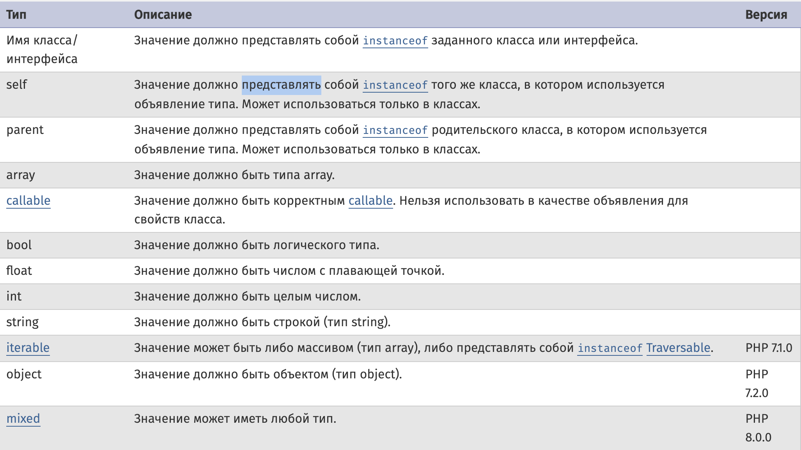
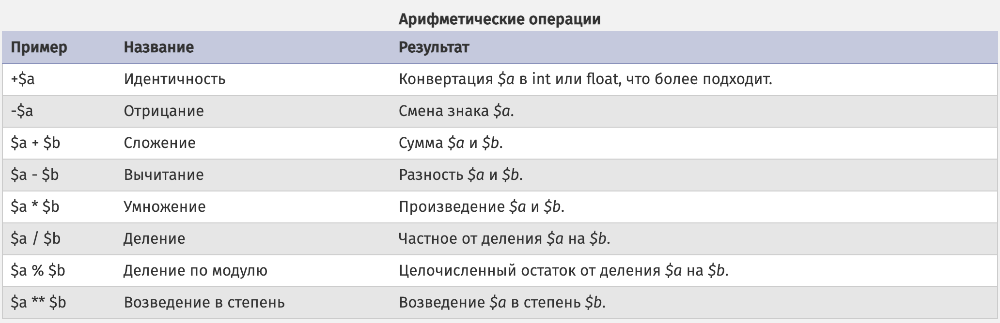
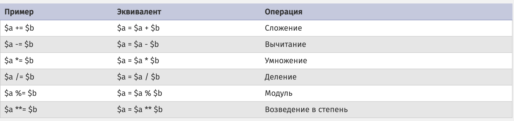
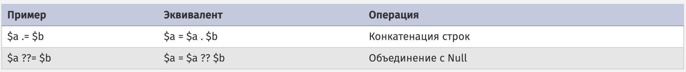
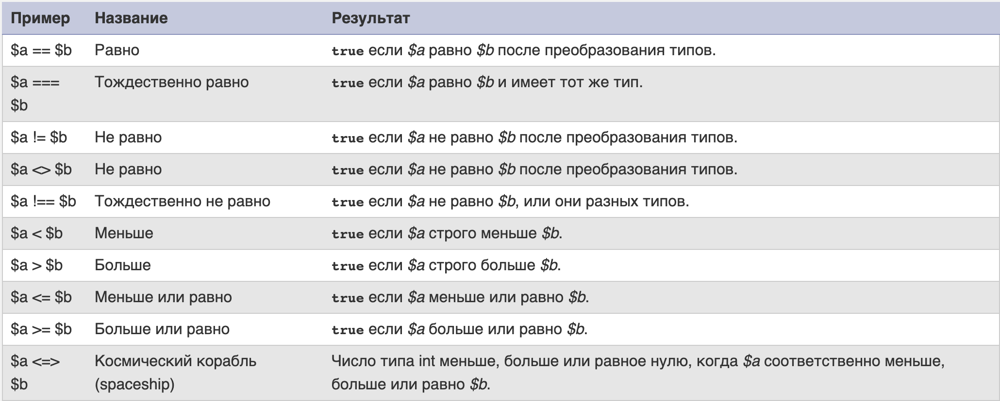
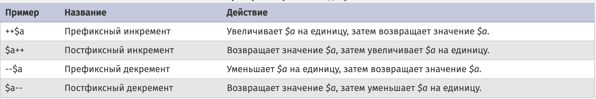
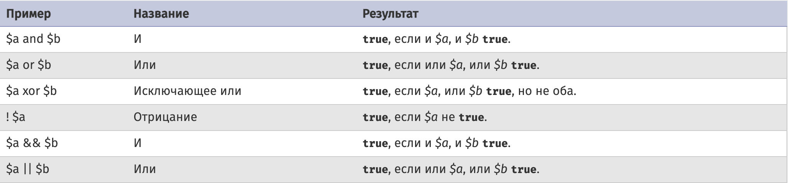
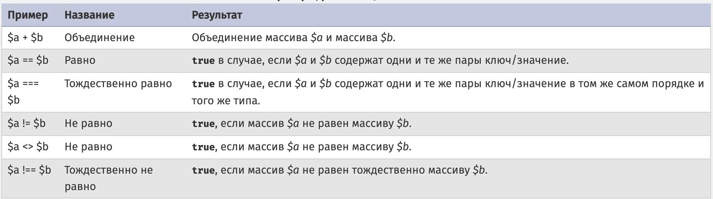

# Основы синтаксиса

## Теги PHP

Открывающие и закрывающие теги PHP

```php
<?php echo 'если вы хотите хранить код PHP в документах HTML, то используйте эти теги'; ?>

Вы можете использовать короткий 'echo'-тег чтобы <?= 'напечатать эту строку' ?>. 
Этот тег эквивалентен такому коду <?php echo 'напечатать эту строку' ?>.
```

Изолирование с использованием управляющих конструкций (if/endif, while/endwhile, for/endfor, foreach/endforeach и switch/endswitch)
```php
<?php if ($expression == true): ?>
  Это будет отображено, если выражение истинно.
<?php else: ?>
  В ином случае будет отображено это.
<?php endif; ?>


<?php for ($i = 0; $i < 5; ++$i): ?>
    Это будет отображено 5 раз
<?php endfor; ?>
```

## Комментарии в PHP

```php
<?php
    echo "Тест"; // Это однострочный комментарий в стиле C++
    echo "Тест 2"; # Это однострочный комментарий в стиле оболочки Unix
    /* Это многострочный комментарий
       ещё одна строка комментария */
    /**
    * Это многострочный комментарий
    * который часто используется для описания документации (функций, классов, API)
    */
?>
```
---

# Типы данных 
## bool
```php
<?php
    $a = true; 
    $a = false;
    // преобразование в boolean других типов
    // Приведёт в false
    var_dump((bool) false);     
    var_dump((bool) 0);         
    var_dump((bool) 0.0);       
    var_dump((bool) "");        
    var_dump((bool) "0");       
    var_dump((bool) []);   
    var_dump((bool) null);
    
    // Приведёт в true
    var_dump((bool) 1);     
    var_dump((bool) -2);        
    var_dump((bool) "foo");     
    var_dump((bool) "0.0");   
    var_dump((bool) 2.3e5); 
    var_dump((bool) [12]); 
    var_dump((bool) "false");
  
?>
```
## int
```php 
<?php
    $a = 1234; // десятичное число
    $a = 0123; // восьмеричное число (эквивалентно 83 в десятичной системе)
    $a = 0o123; // восьмеричное число (начиная с PHP 8.1.0)
    $a = 0x1A; // шестнадцатеричное число (эквивалентно 26 в десятичной системе)
    $a = 0b11111111; // двоичное число (эквивалентно 255 в десятичной системе)
    $a = 1_234_567; // десятичное число (с PHP 7.4.0)
    
    // Если PHP обнаружил, что число превышает размер типа int, он будет интерпретировать его в качестве float
    // PHP_INT_MAX,PHP_INT_MIN - константы, которые сожержит максимальное и минимальное значение целого числа (Размер типа int зависит от платформы - 32/64-битные)
    var_dump(PHP_INT_MAX);  // int(9223372036854775807)
    var_dump(PHP_INT_MAX + 1);  // float(9.223372036854776E+18)
    
    // приобразование в int других типов
    var_dump((int) false);  // 0
    var_dump((int) true);   // 1
    var_dump((int) 1.7);   // 1
    var_dump((int) '1.1');    // 1
    var_dump((int) '1');    // 1
    var_dump((int) '20test1');    // 20
    var_dump((int) 'test1');    // 0
    var_dump((int) null);    // 0    
?>
```

## float (Число с плавающей точкой, также известное как double)
Размер числа с плавающей точкой зависит от платформы.
Хотя максимум, как правило, составляет 1.8e308 с точностью около 14 десятичных цифр (64-битный формат IEEE).
```php
<?php
    $a = 1.234;
    $b = 1.2e3; // 1200.0
    $c = 7E-10; // 0.7
    $d = 1_234.567; // начиная с PHP 7.4.0
    
    // преобразование строки в float
    var_dump((float) '1.44');     // 1.44
    var_dump((float) '1.44test'); // 1.44
    var_dump((float) 'test1.44'); // 0
    // Для значений других типов преобразование выполняется путём преобразования значения сначала в целое число (int), а затем в число с плавающей точкой (float)
    var_dump((float) false); // 0
    var_dump((float) true); // 1
    var_dump((float) []); // 0
    var_dump((float) ['test']); // 1
    
?>
```
Числа с плавающей точкой имеют ограниченную точность.
Кроме того, рациональные числа, которые могут быть точно представлены в виде чисел с плавающей точкой с основанием 10, например, 0.1 или 0.7, не имеют точного внутреннего представления в качестве чисел с плавающей точкой с основанием 2. Подробнее вы можете ознакомиться с причинами этого по [этой ссылке](https://floating-point-gui.de/). 
Поэтому они и не могут быть преобразованы в их внутреннюю двоичную форму без небольшой потери точности.
```php
<?php
    var_dump(0.1+0.7) // выведет 0.7999999999999, хотя ожидается 0.8
    var_dump(floor((0.1+0.7)*10)); // выведет 7, хотя ожидается 8
?>
```
Как указано выше, проверять числа с плавающей точкой на равенство проблематично из-за их внутреннего представления. Тем не менее существуют способы для их сравнения, которые работают несмотря на все эти ограничения.
Для сравнения чисел с плавающей точкой используется верхняя граница относительной ошибки при округлении.
```php
<?php
    $a = 1.23456789;
    $b = 1.23456780;
    $epsilon = 0.00001;
    
    if (abs($a - $b) < $epsilon) { // $a и $b равны до пяти знаков после точки?
        echo "true";
    }
?>
```
Если вам нужна точность в операциях с числами с плавающей точкой вы можете использовать модуль
[BCMath](https://www.php.net/manual/ru/book.bc.php). Эти вычисления работают медленнее по сравнению со стандартными операторами, но дают необходимую точность.
Кроме того вы можете использовать int как базовый тип: хранить и проводить вычисления в целых числах (например в копейках, микро центах и т.д.), но преобразовывать целое число в float при отображении.

## string
```php
<?php
    $string = 'hello';
    $string2 = "world";
    $string3 = "\nhello
    \rworld
    ";

    echo $string;
    echo $string2;
    echo $string3; // выведет слова hello и world в разных строках
    echo "\r{$string} $string2!!!"; // двойные кавычки дают возможность использовать в строках переменные и специальные символы (\n,\r...)
    
    // Получение 3 символа строки
    $str = 'This is a test.';
    $first = $str[3];
    
    // преобразование в строку других типов
    var_dump((string) true); // string(1) "1"
    var_dump((string) false); // string(0) ""
    var_dump((string) 2); // string(1) "2"
    var_dump((string) 1.1); // string(3) "1.1"
?>
```
[Строковые функции](https://www.php.net/manual/ru/language.operators.string.php)
## array
На самом деле массив в PHP - это упорядоченное отображение, которое устанавливает соответствие между значением и ключом. Этот тип оптимизирован в нескольких направлениях, поэтому вы можете использовать его как собственно массив, список (вектор), хеш-таблицу (являющуюся реализацией карты), словарь, коллекцию, стек, очередь и, возможно, что-то ещё. Так как значением массива может быть другой массив PHP, можно также создавать деревья и многомерные массивы.

Key может быть либо типа int, либо типа string. Value может быть любого типа.
```php 
<?php
    // Индексированные массивы без ключа
   
    // Параметр key является не обязательным. Если он не указан, PHP будет использовать предыдущее наибольшее значение ключа типа int, увеличенное на 1.
    $array = array("bar", "foo");

    // асоциативный массив, использование синтаксиса короткого массива
    $array = [
        "foo" => "bar",
        "bar" => [ "foo", "foo1" ],
    ];
    // смешаный массив
    $array = [
        "a", 
        "b", 
        6 => "c", 
        "d"
    ];
    
    list($firstElement, $secondElement) = [1, 2];
    
    // Доступ к элементам массива
    var_dump($array["bar"][1]); // выведет foo1
    
    // добавление нового элемента в массив
    $array[] = "new";
    
    // модификация/добавление по ключу
    $array["new"] = "new";
    
    // удаление элемента с массива
    unset($array["new"]); 
    
    // обьединение массивов
    var_dump($array = [[], ...[2, 3]]); // выведет 1, 2, 3
    
    // До PHP 8.1 распаковка массива со строковым ключом не поддерживалась:
    var_dump($array = [...["a" => 1], ...["a" => 2, "b" => 3]]); // выведет ["a" => 2, "b" => 3] 
?>
```
[Функции для работы с массивами](https://www.php.net/manual/ru/ref.array.php)
## object
````php
<?php 

    class foo
    {
        function do_foo()
        {
            echo "Код foo.";
        }
    }
    
    // создаём объект класса
    $bar = new foo;
    $bar->do_foo();
    
    // результатом преобразования массива в объект будет объект встроенного stdClass  
    $obj = (object) ['test' => 'foo']; 
    var_dump(isset($obj->test)); // выводит 'bool(true)', начиная с PHP 7.2.0; 'bool(false)' ранее
    
    // При преобразовании любого другого значения, оно будет помещено в поле с именем scalar объекта stdClass.
    $obj = (object) 'привет';
    echo $obj->scalar;  // выведет 'привет'
?>
````
## callable
```php
<?php
    $arr = [1, 2, 3];
    
    // callback функция
    function increment($item) {
        return ++$item;
    };
    // увеличиваем каждый элемент массива на 1
    var_dump(array_map('increment', $arr));
    
    // использование методов класса как функции обратного вызова
    class Test {
    
        /**
         * @param int $item
         * @return int
         */
        public function increment(int $item): int
        {
            return ++$item;
        }
    
        /**
         * @param int $item
         * @return int
         */
        public static function staticIncrement(int $item): int
        {
            return ++$item;
        }
    }
    
    var_dump(array_map([new Test(), 'increment'], $arr));
    
    var_dump(array_map(['Test', 'staticIncrement'], $arr));
    
    //Использование замыкания
    $callback = function($item) {
        return ++$item;
    };
    // увеличиваем каждый элемент массива на 1
    var_dump(array_map($callback, $arr));
    
    // то же самое только не присваивая функцию в переменную 
    var_dump(
        array_map(function($item) {
            return ++$item;
        }, $arr)
    ); 
    
    // то же самое с использованием краткой запись callback функции
    var_dump(array_map(fn($item) => ++$item, $arr));
?>
```
## iterable
Iterable - псевдотип, введённый в PHP 7.1. Он принимает любой массив (array) или объект, реализующий интерфейс [Traversable](https://www.php.net/manual/ru/class.traversable.php). Оба типа итерируются с помощью foreach и могут быть использованы с yield from в [генераторах](https://www.php.net/manual/ru/language.generators.php).
```php
<?php 
    //Пример использования iterable в качестве параметра
    function foo(iterable $iterable) {
        foreach ($iterable as $value) {
            // ...
        }
    }
    
    //Пример использования iterable в качестве возвращаемого типа
    function bar(): iterable {
        return [1, 2, 3];
    }
    
    //Пример использования iterable в качестве возвращаемого значения генератора
    function gen(): iterable {
        yield 1;
        yield 2;
        yield 3;
    }
?>
```
## resource
Resource - это специальная переменная, содержащая ссылку на внешний ресурс. Ресурсы создаются и используются специальными функциями. Полный перечень этих функций и соответствующих типов ресурсов (resource) смотрите в [приложении](https://www.php.net/manual/ru/resource.php).
```php
$fp = fopen("../ajax/click.html", "w");
var_dump(gettype($fp)); // string(8) "resource"
```
## NULL
Специальное значение null представляет собой переменную без значения. Null - это единственно возможное значение типа null.
```php
<?php
    var_dump(gettype(null)); //string(4) "NULL"
?>
```
## Объявление типов
Объявления типов могут использоваться для аргументов функций, возвращаемых значений и, начиная с PHP 7.4.0, для свойств класса. Они используются во время исполнения для проверки, что значение имеет точно тот тип, который для них указан. В противном случае будет выброшено исключение TypeError.

```php
<?php
    // Запрещает приведение типов
    declare(strict_types=1);

    // объявления типов для аргументов, и возвращаемого значения для функции
    function test(int|float|null $value): ?string {
        return $value;
    }

    // вызовет ошибки, если включен строгий режим, число не может быть приведено к строке
    var_dump(test(1));
    var_dump(test(1.1));
    var_dump(test(null));

    
    class TypeTest {
        // объявления типов для свойств класса
        public string $test;

        // объявления типов аргументов и возвращаемого значения для функций
        public function test(int $value): void {
            $this->test = (string) $value;
        }
    }

?>
```

---

# Переменные и Константы
Переменные в PHP представлены знаком доллара с последующим именем переменной. Имя переменной чувствительно к регистру.
Область видимости переменной - это контекст, в котором эта переменная определена. В большинстве случаев все переменные PHP имеют только одну область видимости. Эта единая область видимости охватывает также включаемые (include) и требуемые (require) файлы.
```php
<?php
    $foo = 'Боб'; // Присваивает $foo значение 'Боб'
    $foo2 = $foo; // Присваивает $foo2 значение $foo
    $foo = 'Боб 2'; // Присваивает $foo значение 'Боб 2'
    echo $foo; // выведет Боб 2
    echo $foo2; // выведет Боб
    
    // переменные переменных
    $a = 'hello';
    $$a = 'world';
    echo "$a ${$a}"; // выведет Hello World
    
    // область видимости переменных
    $a = 1;

    function sum()
    {
        // есть возможность использовать предопределенную переменную $GLOBALS вместо global
        global $a; // использование переменной с глобальной области видимости - создаётся ссылка
        $b = 1; // локальная область видимости
    
        $a = $a + $b;
    }

    sum();
    echo $a; // выведет 2
    echo $b; // вызовет ошибку, так как эта переменная не доступна
    
    // статические переменные
    function test()
    {
        // Теперь $a будет проинициализирована только при первом вызове функции, а каждый вызов функции test() будет выводить значение $a и инкриминировать его.
        static $a = 0;
        echo $a;
        $a++;
    }

    test(); // результат 0
    test(); // результат 1
    test(); // результат 2
?>
```
Объяснение ссылок
```php
<?php
    // присвоение по ссылке
    $foo = 'Боб';
    $bar = &$foo; // Ссылка на $foo через $bar.
    $bar = 'Боб 2';  // Изменение $bar...
    echo $bar; // выведет Боб 2
    echo $foo; // выведет Боб 2
    
    
    // передача по ссылке
    function foo(&$var) {
        $var++;
    }

    $a = 5;
    foo($a);
    var_dump($a); // выведет 6
    
    
    //Возврат по ссылке
    class foo {
        public $value = 42;

        public function &getValue() {
            return $this->value;
        }
    }

    $obj = new foo;
    $myValue = &$obj->getValue(); // $myValue указывает на $obj->value, равное 42.
    $obj->value = 2;
    echo $myValue;                // отобразит новое значение $obj->value, то есть 2.
?> 
```

[Предопределённые переменные](https://www.php.net/manual/ru/reserved.variables.php) | [Функций работы с переменными](https://www.php.net/manual/ru/ref.var.php)

Константа - это идентификатор (имя) для простого значения. Как следует из названия, их значение не может измениться в ходе выполнения скрипта (кроме магических констант, которые на самом деле не являются константами). Константы чувствительны к регистру. По принятому соглашению, имена констант всегда пишутся в верхнем регистре.

Константы доступны из любой области видимости. Константы можно использовать из любого места скрипта независимо от области видимости. Подробную информацию об областях видимости можно найти здесь.
```php
<?php

    // определение константы
    define('FOO', "test");

    // использование константы
    
    var_dump(FOO); // выведет test
 
?>
```
[Предопределённые константы](https://www.php.net/manual/ru/reserved.constants.php) | [Магические константы](https://www.php.net/manual/ru/language.constants.magic.php)

---

# Операторы
Арифметические операторы



Операторы присваивания




Операторы сравнения



Операторы инкремента и декремента



Логические операторы



Операторы, работающие с массивами




Другие операторы

```php 
<?php
    // оператор конкатенации строк
    $a = "Привет, ";
    $b = $a . "Мир!"; // $b теперь содержит строку "Привет, Мир!"
    // или такой вариант:
    $a .= "Мир!"; 
    
    //Оператор проверки типа
    class MyClass
    {
    }

    class NotMyClass
    {
    }

    var_dump(new MyClass() instanceof MyClass);
    var_dump(!(new MyClass() instanceof MyClass)); // отрицание
?>
```

---

#Управляющие конструкции

Любой сценарий PHP состоит из последовательности инструкций. Инструкцией может быть присваивание, вызов функции, повтор кода (цикл), сравнение, или даже инструкция, которая ничего не делает (пустой оператор). После инструкции обычно ставится точка с запятой. Кроме того, инструкции могут быть объединены в блоки заключением их в фигурные скобки. Блок инструкций также сам по себе является инструкцией. В этом разделе описываются различные типы инструкций.

## If

```php
<?php 
    if ($a > $b) {
        echo "a больше b";
    } elseif ($a < $b)) { // необязательно должен быть
        echo "b больше a";
    } else { // необязательно должен быть
        echo "a и b равны";
    }
?>
```
## Switch
```php 
<?php 
    $i = 0;
    switch ($i) {
        case 0:
            echo "i равно 0";
            break;
        case 1:
            echo "i равно 1";
            break;
        case 2:
            echo "i равно 2";
            break;
        default:  // не обязательно
           echo "i не равно 0, 1 или 2";
    }
?>
```

## Match (c php 8.0)
```php 
<?php 
    $food = 'cake';
    $value = match ($food) {
        'apple' => 'На столе лежит яблоко',
        'banana' => 'На столе лежит банан',
        'cake', 'cookie' => 'На столе торт или печенье',
         default => 'На столе пусто', // не обязательно, но если нет вызовет ошибку
    };
    var_dump($value);
?>
```

## Loop
```php
<?php
    $maxIterations = 5;
    
    // while 
    $i = 1;
    while ($i <= 10) {
        echo $i++;  /* выводиться будет значение переменной $i перед её увеличением (post-increment) */
        if ($i === $maxIterations) { // Останавливает выполнение цикла. Доступно для любого из видов циклов
            break;
        }
    }
    
    // do-while
    $i = 0;
    do {
        $i++;
        if ($i < $maxIterations) { // Переходит к следующей итерации. Доступно для любого из видов циклов
            continue;
        }
        echo $i;
    } while ($i <= 10);
    
    // for 
    for ($i = 1; $i <= 10; $i++) {
        echo $i;
    }
    
    // foreach
    $arr = [1, 2, 3, 4];
    foreach ($arr as $value) { // обход массива с доступом к значению
        $value = $value * 2;
    }
    
    foreach ($arr as $key => $value) { // обход массива с доступом к ключу и значению
        $value = $value * 2;
    }
    
?>
```

## include / include_once, require / require_once
Выражение include и require включает и выполняет указанный файл.

Require аналогично include, за исключением того, что в случае возникновения ошибки он также выдаст фатальную ошибку уровня E_COMPILE_ERROR. Другими словами, он остановит выполнение скрипта, тогда как include только выдал бы предупреждение E_WARNING, которое позволило бы скрипту продолжить выполнение.

Выражение require_once, include_once аналогичны require, include за исключением того, что PHP проверит, включался ли уже данный файл, и если да, не будет включать его ещё раз.
```php
<?php
     include 'test.php';
     require 'test.php';
     
     include_once 'test.php';
     require_once 'test.php';
?>
```

---

# Функции

```php
<?php
    /**
     * Пример функции
     *
     * @param int|null $value
     *
     * @return void
     */
    function foo($val2, ?int $val2 = null): void // обязательные аргументы должны быть объявлены перед необязательными 
    {
        echo "значение в функции $value.\n";
    }
    
    /**
     * Рекурсивная функция
     *
     * @param int $a
     *
     * @return void
     */
    function recursion(int $a = 1): void 
    {
        if ($a < 20) {
            echo "$a\n";
            recursion($a + 1);
        }
    }
    
    recursion(); 
    
    
    // Списки аргументов переменной длины
    function sum(int ...$numbers) { // каждый элемент массива будет int
        $acc = 0;
        foreach ($numbers as $n) {
            $acc += $n;
        }
        return $acc;
    }

    echo sum(1, 2, 3, 4);
    
    // Использование ... для передачи аргументов
    function add(int $a, int $b) {
        return $a + $b;
    }

    echo add(...[1, 2])."\n";
    
    // Синтаксис именованного аргумента
    function add2(int $a, int $b, int $c) {
        return $a + $b + $c;
    }

    // Порядок, в котором передаются именованные аргументы, не имеет значения
    // Вы можете использовать именованные аргументов вместе с позиционными аргументами
    echo add2(1, b: 1, c: 1);
    
    // Возврат нескольких значений в виде массива
    function small_numbers(): array
    {
        return [0, 1, 2];
    }
    // Деструктуризация массива будет собирать каждый элемент массива индивидуально
    [$zero, $one, $two] = small_numbers();
    
    // Анонимные функции
    $message = 'test';
    $example = function () use ($message) { // Наследование переменных из родительской области видимости
        var_dump($message);
    };
    $example();
    
    // Стрелочные функции 
    $y = 1;
    $fn1 = fn($x) => $x + $y; // Стрелочные функции захватывают переменные по значению автоматически
    $fn1(1);
?>
```
[Справочник встроенных функций](https://www.php.net/manual/ru/funcref.php)
